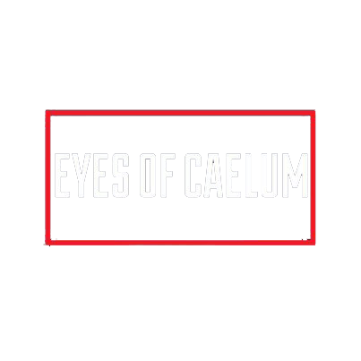

<!-- PROJECT LOGO -->

 

  

<h1 align="center">Eyes of Caelum</h1>

    A responsive website made in HTML, CSS and JavaScript for the Plymouth-based music band, Eyes of Caelum
     
    <a href="https://github.com/Parker06/Turing-Machine-Simulator"><strong>Explore the docs »</strong></a>
     
  

(<a href="#readme-top">back to top</a>)

### Built With

- HTML
- CSS
- JavaScript
- Google Firebase

(<a href="#readme-top">back to top</a>)

